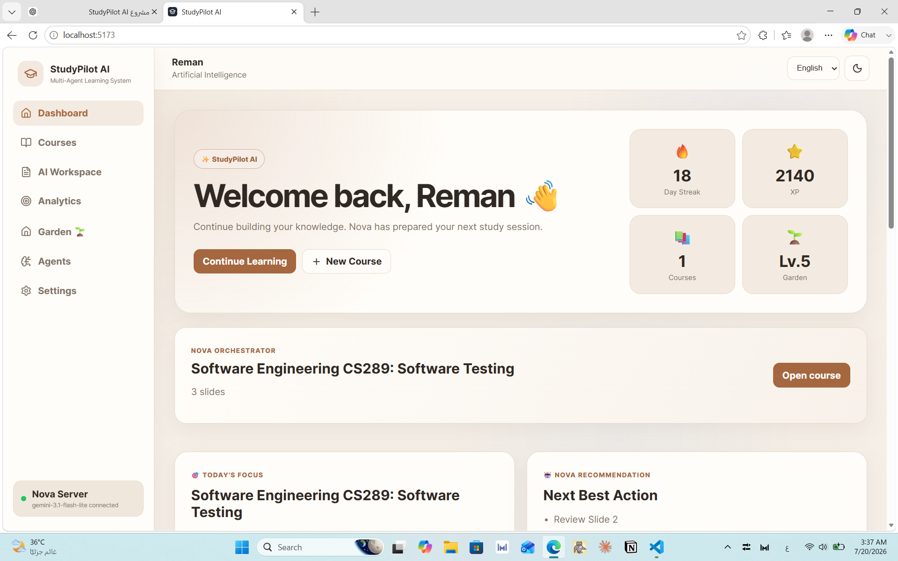
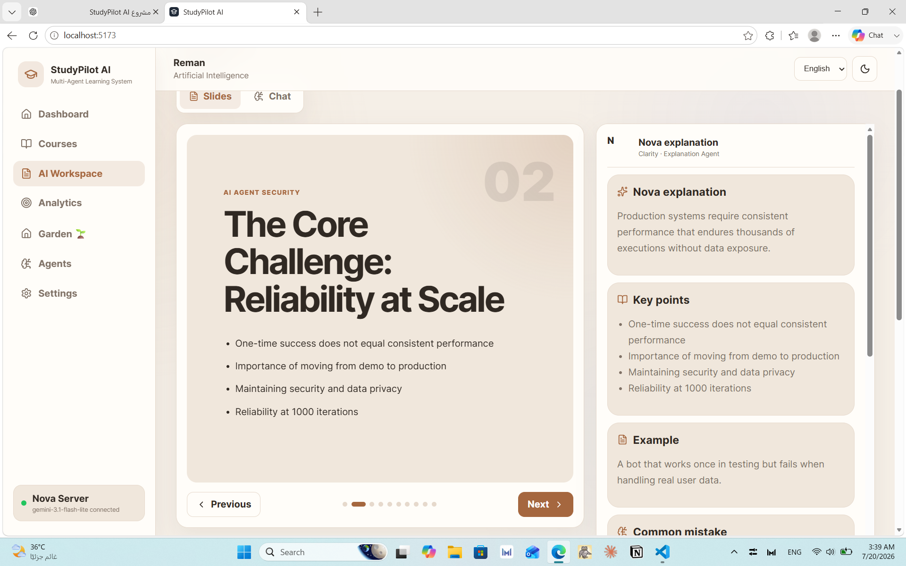
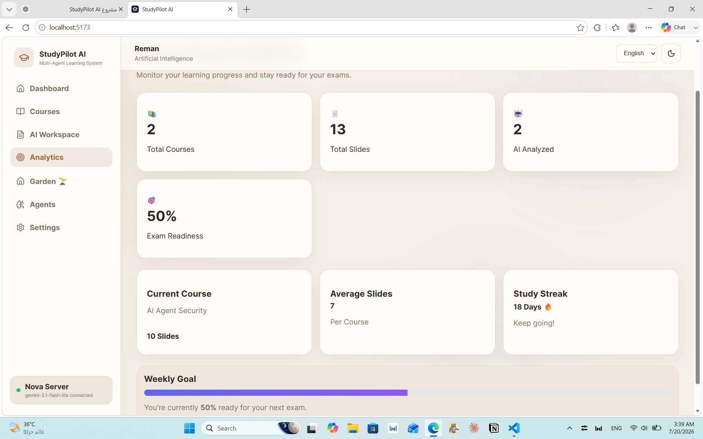
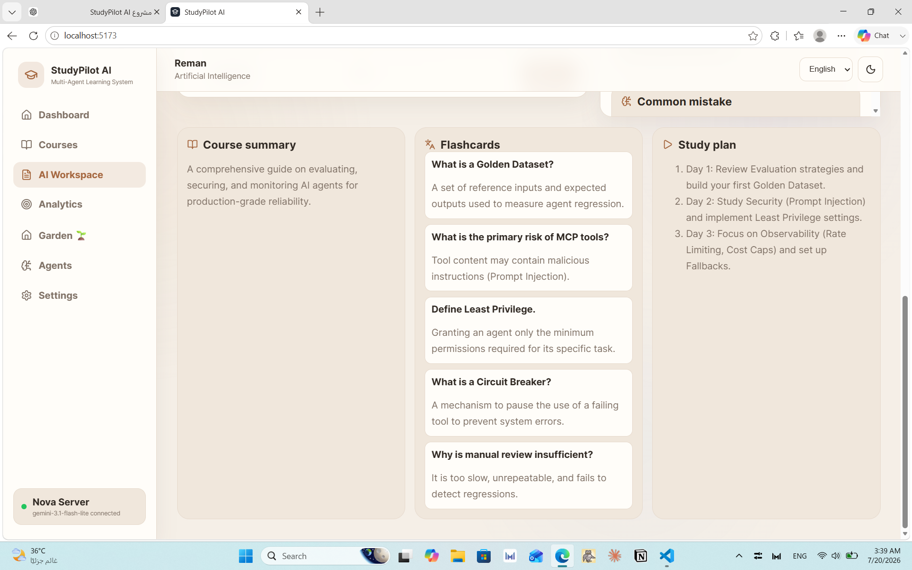
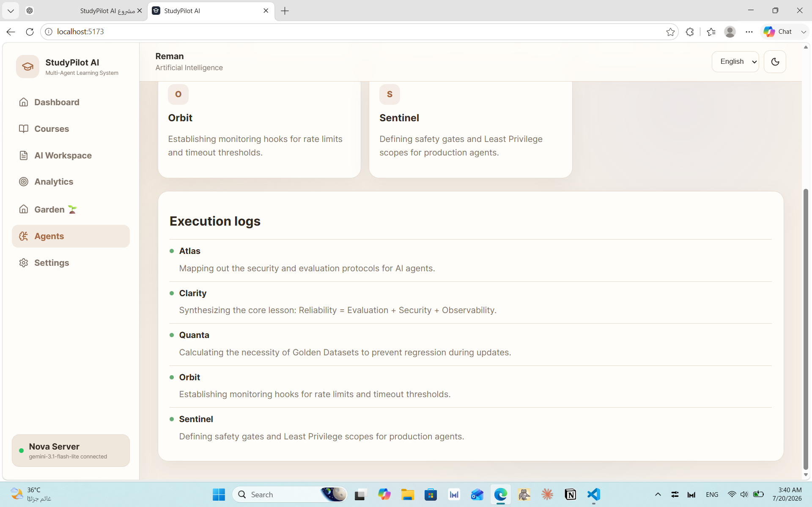

<div align="center">

# 🎓 StudyPilot AI

### Your Personal Academic Mentor

An AI-powered Multi-Agent Learning Platform for University Students

🌐 **Live Demo:** https://study-pilot-ai-five.vercel.app/

</div>

---

## 🚀 Features

- 📄 AI PDF Analysis
- 🤖 AI Tutor
- 🧠 Smart Summaries
- 📝 Quiz Generator
- 🎴 Flashcards
- 📅 Personalized Study Plans
- 📊 Analytics Dashboard
- 🤖 Multi-Agent Architecture
  

# 📖 Overview

StudyPilot AI is a smart educational platform built to solve one of the biggest challenges university students face:

> Understanding large amounts of lecture materials and preparing efficiently for exams.

Instead of spending hours reading slides manually, students can upload their lecture notes and let multiple AI Agents analyze, explain, summarize, and generate personalized study resources.

---

# 🚨 Problem

University students often struggle with:

- Understanding difficult lecture materials
- Spending too much time creating summaries
- Preparing for exams efficiently
- Tracking study progress
- Organizing study plans

---

# 💡 Solution

StudyPilot AI transforms uploaded lecture materials into an interactive learning experience using specialized AI Agents.

Students can:

- 📄 Upload lecture PDFs
- 🧠 Generate AI summaries
- 📝 Create quizzes automatically
- 🎴 Generate flashcards
- 📅 Receive personalized study plans
- 📊 Track learning progress
- 🌱 Stay motivated through gamification

---

# 🤖 Multi-Agent Architecture

The platform uses multiple specialized AI Agents.

| Agent | Responsibility |
|--------|----------------|
| 🧠 Nova | Personal AI Tutor |
| 📄 Atlas | PDF Analysis |
| ✨ Clarity | Smart Summarization |
| 📝 Quanta | Quiz Generation |
| 📅 Orbit | Study Planning |
| 🛡️ Sentinel | Security & System Monitoring |

Each agent performs a dedicated task, making the system faster, more modular, and easier to extend.

---

# 🔄 Workflow

```
Student

↓

Upload Lecture PDF

↓

Atlas analyzes document

↓

Clarity generates summary

↓

Nova explains concepts

↓

Quanta creates quizzes

↓

Orbit generates study plan

↓

Dashboard updates progress

↓

Student learns efficiently
```

---

# ✨ Features

- AI PDF Analysis
- AI Tutor
- Smart Summaries
- Quiz Generator
- Flashcards
- Personalized Study Plans
- Progress Dashboard
- Learning Garden
- Multi-Agent System
- Modern Responsive UI

---

# 🖥️ Screenshots

## Dashboard


---

## AI Workspace


---

## PDF Analysis


---

## Quiz Generator


---

## AI Agents


# 🛠️ Technologies Used

### Frontend

- React
- Vite
- JavaScript
- HTML5
- CSS3

### AI

- Google Gemini API
- Prompt Engineering
- Multi-Agent Architecture

### Development

- Git
- GitHub
- Vercel
- VS Code

---

# 🎯 Future Improvements

- User Authentication
- Cloud Database
- Multi-device Synchronization
- Mobile Application
- Voice AI Tutor
- Collaborative Learning
- Analytics Dashboard
- Learning Recommendations

---

# 🎥 Demo

Live Website

https://study-pilot-ai-five.vercel.app/

---

# 👨‍💻 Author

**Reman Hussam Ghawanni**

Artificial Intelligence Student

AI Agent Engineering Bootcamp

Taibah University

---

# 📄 License

This project was developed for educational purposes as the final project of the AI Agent Engineering Bootcamp.
